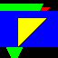

# Mach64 preserves clipped-fan order in merged DrawPrimitives records

Date: 2026-09-30. Gateway SOLO2150, ATI Rage Mobility-M `1002:4C4D`,
Windows 98 SE. The targeted physical clipped-fan ordering gate passes.
Evidence: [raw reports and readbacks](../probe/d3d-record-merge-2026-09-30/clipped-fans/).
This closes the outstanding clipped-fan checks in
[in-call batch merging](../plans/r3d-in-call-batch-merging.md) and
[record merging](../plans/d3d-drawprimitives-record-merging.md).

## Probe and oracle

Built [V9XRCLP.EXE](../../tools/diag/record_clip_probe_win32.c) with
`scripts/build-record-clip-probe.ps1`. The executable uses the existing
DDGET32BITDRIVERNAME escape to find the validated shared block, requests the
published DX5 callback table, creates a context and calls its actual
`DrawPrimitives` callback. It takes the calibrated Win16 mutex around the
DDI calls. No new HAL export, driver change, mode switch or runtime
preclipping is involved. The target is a 64x64 video-memory surface.

Four overlapping records carry, in order:

1. An on-target red triangle.
2. A green triangle crossing the left and bottom target boundaries, which
   the core expands into a clipped fan.
3. A blue four-vertex fan crossing the left and right boundaries. Both of
   its triangles require clipping.
4. An on-target yellow triangle which must remain last.

Opaque colour overlap exposes ordering without depending on blend support.
Each reference submits the records as separate calls in original order.
The test then submits the same records in one call and compares all 4096
16-bit pixels, after a waiting DirectDraw Lock drains the engine. Three cases
cover ordinary state-free continuation, redundant state pairs on every
record, and the 64-triangle capacity boundary. The last case repeats the
red triangle 62 times: together with the green triangle it produces a
63-triangle record run whose clipped expansion crosses the staging capacity;
the following blue fan starts another record run.

A negative control reverses all four records. It differs at **1657 pixels**
on both HALs, proving that the oracle detects reordering and is not merely
comparing blank targets.

## Physical results

Candidate boot 66, SHA256
`3F6439204C7F21F3EBFB810024A733E22DAB6424038F82BEB697E1E85B1B1B41`.
Control boot 67, same source tree with record merging removed, SHA256
`D45BBB26A343542FE2600168EC23F7687D4B84912AEE6769AF32E7F564D0D4D3`.
Both installed HALs were downloaded and hash-verified. The probe binary is
identical for both runs; its `Build` key names the probe, not the loaded HAL.

| Case | Candidate list calls / sink batches | Control list calls / sink batches | Clipped input triangles, each HAL | Pixel mismatches, each HAL |
|---|---:|---:|---:|---:|
| Ordinary continuation | 1 / 1 | 4 / 4 | 3 | 0 |
| Redundant state pairs | 1 / 1 | 4 / 4 | 3 | 0 |
| Capacity boundary | 2 / 3 | 4 / 4 | 3 | 0 |

Both reports returned `PASS`, with zero new batch refusals, FIFO/idle
timeouts or resets. All twelve PPM files (three references and three test
outputs on each HAL) are byte-identical, CRC32 `FB32474C`. Repeated red
triangles cover the same pixels, so the capacity-case final image is
expected to match the small cases; its counters establish the different
submission and clipping path.

The initial control staging command used the wrong local path and continued
to reboot after the upload failed. WININIT removed the old HAL but could not
install its replacement. On boot 67, before any graphics validation, the
missing HAL was repaired with the exact control and hash-verified. The
return-to-candidate procedure checks every transfer result and verifies the
staged HAL and rename file before rebooting. This setup error was not a
rendering-test failure and does not explain the older boot-63 broad-probe
hard lock, which remains unresolved.

The Gateway returned to the exact candidate on boot 68. Its installed hash
was verified and the probe repeated: `PASS`, the same call/batch/clipping
counts, zero pixel differences and zero new failures. The report and binary
hash provenance are retained alongside the first two runs. The probe build,
`check-tree.ps1`, the full `run-checks.ps1` (including all five family
packages), and whitespace checks passed.

This test establishes order and pixel equivalence for deliberately clipped,
opaque, untextured geometry, including redundant state and capacity splits.
Separate textured benchmark and recorded gameplay checks are documented in the physical and gameplay decisions.

## Final refusal-fix retest

The final fixed HAL passed this same targeted validation on Gateway boot 71:
all three cases have zero pixel differences and no new engine failures;
all six images match the earlier control exactly. See the retained
[follow-up evidence](../probe/d3d-record-merge-2026-09-30/gateway-refusal-fix/README.md).
The broad probe hard-locked on boot 70; that cause remains unresolved.
The separately recorded gameplay comparison has since completed, including
the final netbook refusal-fix validation.

Gateway follow-up: three broad reruns completed on boots 71-73, including
two fresh boots and the unmodified probe. All checks match baseline (202/14),
with zero timeouts/resets. The boot-70 intermittent lock remains open; see
[retained investigation](../probe/d3d-record-merge-2026-09-30/gateway-refusal-fix/README.md).
